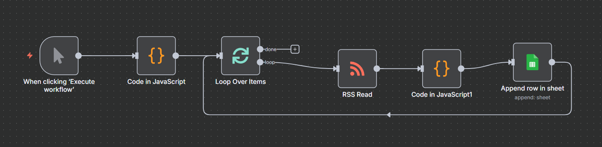

# 🚀  n8n 爬文極簡教學2：多網站 AI 關鍵字文章追蹤器

本文件總結了在 n8n 平台搭建一個多網站 RSS Feed 爬取、內容清洗、篩選及數據輸出到 Google Sheets 的工作流架設經驗。流程步驟如下：

1. **多來源抓取**： 
   - 通過 Loop Over Items 節點，實現對多個 RSS Feed URL 的循環讀取和獨立處理。
   - Loop Over Items 在此工作流中是實現**多網站爬取**的核心：
     - 功能： 它負責將第一個 Code Node 輸出的多個 URL 項目，逐一單獨傳遞給下游的 RSS Read 節點。確保每個 RSS Feed 都能獨立、完整地被讀取和處理，避免單一 RSS Read 節點處理多個 URL 時可能導致的資料混亂或處理失敗。
2. **內容篩選與清洗**：
   - 篩選出標題中包含大寫 "AI" 的文章，並對內容進行去亂碼、去 HTML 標籤、摘要化等清洗。
3. **數據輸出**： 
   - 將最終的 5 個核心欄位（Title, Link, PubDate, Content, SourceName）輸出到 Google Sheets。

## 💡 流程痛點與解決方法

1. **始終抓取不到資料來源 (網站名稱)**：
   - 在 n8n 的 Loop Over Items 結構中，下游的 RSS Read 節點會產生數十個新的文章項目，這會導致原始 Loop 節點傳遞的數據（例如手動定義的 sourceName）無法被穩定地引用。
2. **冗長的工作流**:
   - 為每個操作（篩選、欄位編輯、數據轉換）都配置一個獨立的節點，會導致工作流冗長到難以閱讀。
3. **資料寫入Google Sheets 後跑版或分析錯誤**:
   - 來自不同媒體的 RSS Feed 格式不一，經常帶有 HTML 標籤、亂碼（如 &#8230;）或過長內容，會導致最終輸出到 Google Sheets 時數據跑版或分析錯誤。

### 解決方法

| 問題 | 處理策略 | 搭配 n8n 節點 | 說明 |
| :--- | :--- | :--- | :--- |
| **抓取不到資料來源 (網站名稱)**| 在文章層級上直接判斷來源。| Code in JavaScript | 直接在程式碼中根據 link 欄位推斷來源，確保數據準確。 |
|**冗長工作流**| 將所有處理邏輯集中於一個節點。 | Code in JavaScript |移除 Edit Fields 等節點，提高工作流的執行效率和維護性。 |
|**內容包含 HTML 標籤/亂碼、跑版**| 強制移除所有 HTML 標籤及實體亂碼。 | Code in JavaScript | 確保輸出到 Google Sheets 的內容是純文本，消除`
、` 標籤造成的分析錯誤和跑版。 |

  
## 🛠️ 流程節點總覽

本次工作流的核心概念，是將多個單一功能節點（Filter, Edit Fields等）整合到單一的 JavaScript Code 節點中，避免冗長的工作流。

- **節點 1 - Code Node (URLs):** 
  - 定義要爬取的 RSS Feed URL 清單，輸出多個帶 feed 屬性的項目。
- **節點 2 - Loop Over Items:**
  -  循環處理每個 Feed URL ，確保每個 Feed 獨立處理。
- **節點 3 - RSS Read:** 
  - 讀取當前 Feed 的文章內容，輸出多個文章項目。
- **節點 4 - Code in JavaScript1:**
  - 執行解碼、去標籤、命名、篩選、摘要化和欄位整理。
- **節點 5 - Google Sheets:**
  - 將處理好的 5 個欄位數據附加到試算表。

實際節點呈現如下圖：

  

# 🎓 下一步： 挑戰「分析抓取文章的SEO關鍵字」
在成功創建抓取多個動態新聞網站的工作流後，將挑戰能分析標題、URL和Summary資料，以提取文章SEO關鍵字的工作流，打造個人的 SEO 情報蒐集與分析工具。